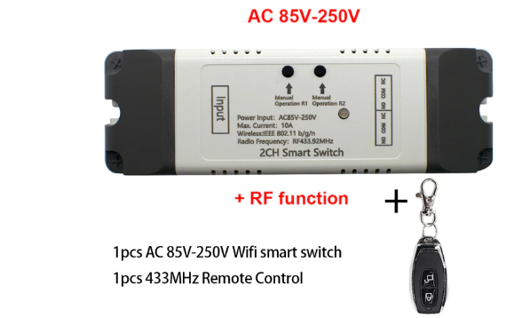

# EspHome Garage Door Controller

Read this in other languages: [Polish](README.pl.md)



## Introduction

In my search for a WiFi device with 2 Channel Relay that I could integrate with the Home Assistant with the help of EspHome, I found a cheap device equipped with the Esp8285 module.
The device is available in a version with DC 12-24V and AC 230V power supply.
It has compact dimensions a practical housing and is available in a version with or without  433MHz wireless RF receiver that allows to pair several remote control.

Sample offer on the Aliexpres platform for $22::
* [2CH DC 12V 24V AC 220V WiFi Switch Smart Gate Garage Door Opener eWeLink APP 433mhz Remote Controller](https://www.aliexpress.com/item/1005002039210523.html)


The device version without a 433MHz receiver is an ideal platform for making a water valve controller
together with a water meter using the tcrt5000 module, e.g. from the following project.
[Measurement of water consumption directly from your water meter with a TCRT5000 like sensor and ESPHome](https://github.com/hugokernel/esphome-water-meter) - using port GPIO4.

## Flashing firmware 

The device is programmed by default to work with the eWeLink application via the cloud.
Installing EspHome requires a USB to TTL converter that supports 3.3V
You can use the following converter [FT232RL USB 3.3V 5.5V do TTL](https://pl.aliexpress.com/item/2019421866.html)
Unfortunately, the presented version of the device is not equipped with a programming connector, so in order to flash the device is necessary to solder a goldpin connector directly to the pins of the ESP8285 module using short wires .

On the Internet you can find an article on how to hack a similar device using Tasmota:
* [Hacking Unknown 2 Channel Relay With Tasmota - John's Tech Blog](https://hagensieker.com/2019/02/21/hacking-unknown-2-channel-relay-with-tasmota/)

[EspHome](https://esphome.io/) is installed in a similar way. 
Connect the converter to the 3V3 and GND pins, the RX pin of the converter to the TX of the module and the TX pin of the converter to the RX of the module.
During flashing the device is powered from the converter.
Before connecting the converter to the USB port, press the module button (close to the relays) and keep it pressed throughout the whole programming process - I suggest to wire GPIO0 to the programming connector and connect it to GND.

Below is a view of the board with the correct pinout of the ESP8285 module.


**Note**: You are flashing the device at your own risk, taking into account the loss of warranty and the loss of the ability to use the eWeLink cloud.

## Installation
There are many guides about ESPHome integration with Home Assistant.
In short in HA you need to do the following:
* create new EspHome device (with **name** that does not contain special characters)
* in the **garagedoor.yaml** file enter the same **name** in "esphome" section
* in the "substitutions" section you can enter a more friendly **devicename**
* I recommend setting a unique **password** in the "ota" section. 
* check the other passwords
* decide whether to use HA API or MQTT (like Tasmota) or both
* copy the **garagedoor.yaml** configuration file to Home Assistant in place of the generated one
* connect the converter to the Home Assistant server's usb port and install the software
* disconnect the converter and connect the module power supply, 
* the device should connect to the WiFi network, or it will start in access point mode to configure the network
* after Home Assistant restarts, a new EspHome integration will be detected, it must be configured by providing the correct api_password
* it may be necessary to fine-tune the configuration, which can be done later over WiFi
```
cover:
  - platform: time_based
    open_duration: 30s
    close_duration: 30s
```
## Functionality

* the device can be controlled remotely from the Home Assistant application, using scripts, as well as with the use of NodeRed,
* buttons on the housing and remote control enable manual control,
* when the open or close button is pressed, the appropriate relay is activated and the status LED lights red with 40% brightness
* pressing any button during the opening or closing operation turns off both relays,
* another pressing of the open or close button causes the continuation of the operation,
* the fully open state is signaled by switching off the status LED,
* the fully closed state is indicated by the red status Led with 100% of brightness

**Note**: If the device is connected to the garage door, **the wiring should be done in such a way that it is physically impossible to supply power to the motor from both relays at the same time**.

## Configuring 433MHz remote controls
If the module is equipped with a remote control receiver, you can pair the remotes with the module in accordance with the original manufacturer's instructions because it works independently of the loaded software.

#### Remote controll pairing
* press one of the the device buttons on the device and hold it until the LED lights up blue,
* press one of the buttons on the remote control,
* repeat the operation with the second device button and the remote control.

#### Remote controll unpairing
* in order unpair remote control for device, keep the button pressed for more than 10s - the LED lights up blue, then it turns off, and after button release the LED blinks several times to indicate deleting the assignment,
* repeat the operation with the second device button,
