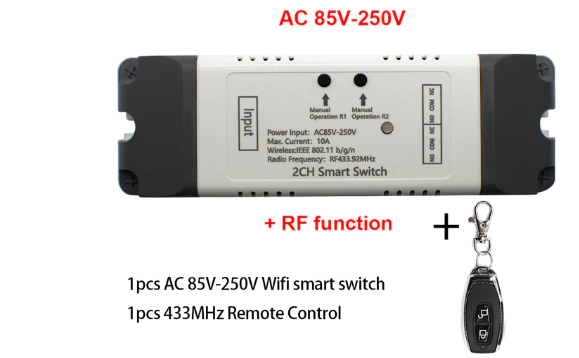
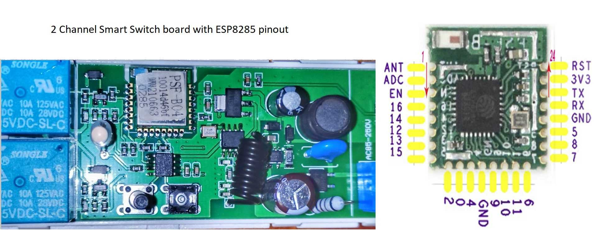

# EspHome Garage Door Controller

Read this in other languages: [English](README.md)



## Wprowadzenie

W swoich poszukiwaniach urządzenia WiFi z dwoma przekaźnikami, które mógłbym z pomocą EspHome zintegrować z Home Assistantem trafiłem na tanie urządzenie wyposażone w moduł Esp8285.
Urządzenie występuje w wersji z zasilaniem napięciem DC 12-24V oraz AC 230V. 
Urządzenie ma kompaktowe wymiary, praktyczną obudowę, występuje w wersji z lub bez odbiornika 433MHz dającego możliwość sparowania kilku pilotów.

Przykładowa oferta na platformie Aliexpres w cenie $22:
* [2CH DC 12V 24V AC 220V WiFi Switch Smart Gate Garage Door Opener eWeLink APP 433mhz Remote Controller](https://www.aliexpress.com/item/1005002039210523.html)


Urządzenie w wersji bez odbiornika 433MHz jest idealaną platformą do wykonania sterownika zaworu wody 
wraz z licznikiem wody z zastosowaniem modułu tcrt5000 np. z poniższego projektu
[Measurement of water consumption directly from your water meter with a TCRT5000 like sensor and ESPHome](https://github.com/hugokernel/esphome-water-meter) - przy wykorzystaniu portu GPIO4.

## Flashowanie

Urządzenie domyślnie jest zaprogramowane do współpracy z aplikacją eWeLink poprzez chmurę.
Zainstalowanie EspHome wymaga podłączenia konwertera USB-TTL pracującego z napięciem 3.3V.
Można użyć [FT232RL USB 3.3V 5.5V do TTL](https://pl.aliexpress.com/item/2019421866.html)
Niestety, prezentowana wersji urządzenia nie została wyposażona w złącze do programowania więc konieczne jest przylutowanie złącza goldpin kabelkami bezpośrednio do pinow modułu ESP8285 w celu przeprogramowania urządzenia.

W internecie można znaleźć artykuł jak zhakować podobne urządzenie przy pomocy Tasmota:
* [Hacking Unknown 2 Channel Relay With Tasmota - John's Tech Blog](https://hagensieker.com/2019/02/21/hacking-unknown-2-channel-relay-with-tasmota/)

W podobny sposób instaluje się [EspHome](https://esphome.io/).
Należy podłączyć konwerter do pinów 3V3 i GND, pin RX konwertera do TX modułu a pin TX konwertera do RX modułu.
Urządzenie w czasie flashowania jest zasilane z konwertera. 
Przed włączeniem konwertera do portu USB należy wcisnąć przycisk modułu od strony przekaźników i trzymać wciśnięty przez cały proces programowania - sugeruję wyprowadzenie GPIO0 na złącze programowania i podłączenie go do GND.  

Poniżej przedstawiam widok płytki z prawidłową rozpiską pinów modułu ESP8285.


Uwaga: Flashujesz urządzenie na własną odpowiedzialność licząc się z utratą gwarancji i utratą możliwości  z korzystana z chmury EWELink. 

## Instalacja
Odsyłam do poradników dotyczących integracji ESPHome w Home Assistant.
W wielkim skrócie w HA należy wykonać następujace czynności.
* wygenerować nowe urządzenie EspHome (o nazwie nie zawierajacej znaków specjalnych)  
* w pliku **garagedoor.yaml** wpisać tę samą "name" w sekcji "esphome"
* w sekcji "substitutions" można wprowadzić bardziej przyjazne "devicename"
* zalecam ustawić unikalne "password" w sekcji "ota" 
* sprawdzić konfigurację pozostałych haseł 
* zdecydować się czy użyć HA API czy MQTT (jak Tasmota), czy obu
* skopiować konfigurację **garagedoor.yaml** do Home Assistanta w miejsce wygenerowanej wcześniej
* podłączyć konwerter do portu usb serwera Home Assistant i wykonać instalację
* odłączyć konwerter i podłączyć zasilanie modułu
* urządzenie powinno połączyć się z siecią WiFi, ewentualnie uruchomi się w trybie access pointa w celu skonfigurowania sieci
* po restarcie Home Assistanta zostanie wykryta nowa integracja EspHome, należy ją skonfigurować podając właściwe api_password
* konieczne może okazać się dostrojenie konfiguracji, które można wykonać później przez WiFi
```
cover:
  - platform: time_based
    open_duration: 30s
    close_duration: 30s
```
## Funkcjonalność

* urządzeniem można sterować zdalnie z aplikacji Home Assistant, za pomocą skryptów, a także z wykożystaniem NodeRed
* przyciski na obudowie oraz pilot zdalnego sterowania umożliwiają serowanie ręczne,
* w momenci wciśnięcia przycisku otwierania lub zamykania włącza się odpowiedni przekaźnik a czerwona LED statusu świeci się 40% jasnością,
* wciśnięcie dowolnego przycisku w trakcie operacji otwierania lub zamykania wyłącza oba przekaźniki,
* kolejne naciśnięcie przycisku otwierania powoduje kontynuację operacji,
* całkowite otwarcie sygnalizowane jest zgaszeniem LED statusu,
* całkowite zamknięcie sygnalizowane jest zapaleniem LED statusu na 100% jasności,

**Uwaga**: W przypadku podłączenia urządzenia do bramy garażowej **okablowanie należy wykonać tak aby fizycznie uniemożliwić podania zasialnia na silnik z obu przekażników jednocześnie**.

## Konfiguracja pilotów 433MHz
Jeżeli moduł jest wyposażony w odbiornik zdalnego sterowania można sparować piloty z modułem zgodnie z oryginalną instrukcją producenta gdyż działa on niezależnie od wgranego softu.

#### Programowanie pilotów
* wciskamy przycisk jeden z przycisków i trzymamy do momentu zapalenia się niebieskiej LED
* wciskany jeden z przycisków na pilocie
* powtarzamy czynność z drugim przyciskiem modułu i pilota.

#### Kasowanie pilotów
* skasowanie przypisania pilota do konkretnego przycisku następuje po jego dłuższym przytrzymaniu (ponad 10s)- niebieska dioda zapala się następnie gaśnie, wtedy puszczmy przyciski i dioda zamiga kilka razy sygnalizując skasowanie przypisania. Czynności wykomujemy dla obu przycisków osobno.
* czynność powtarzamy dla drugiego przycisku.
